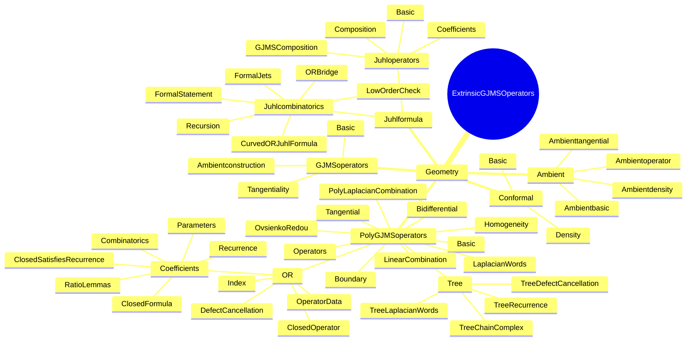
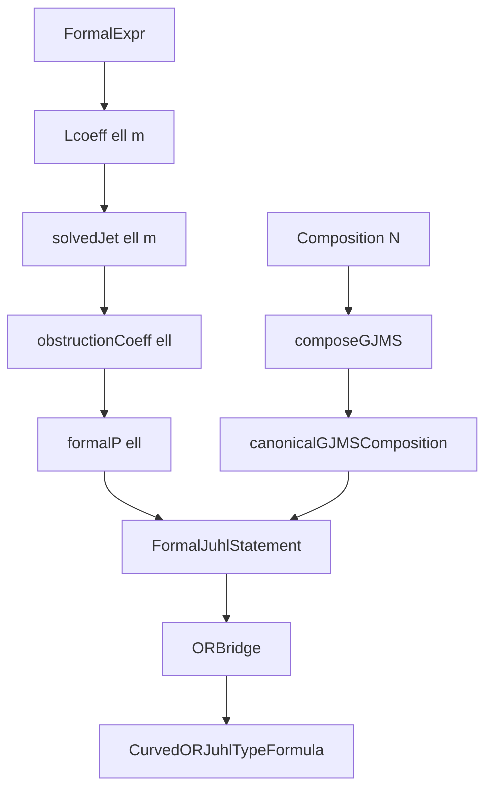
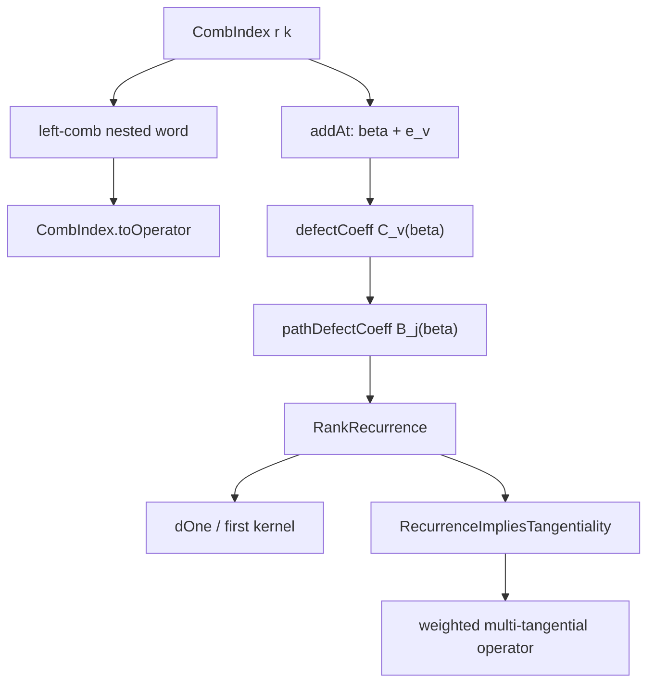

# Higher Order Extrinsic GJMS Operators

This repository is a Lean 4 formalization project for higher-order extrinsic
GJMS operators and related ambient, poly-GJMS, Ovsienko-Redou, and Juhl-type
formula structures.

The project is being developed by ZeTian Yan and Victor Xiao.

## Project Map



## Mathematical Layers

### 1. Conformal and Ambient Foundations

The files under `Geometry/Conformal` and `Geometry/Ambient` provide the formal
background objects used by the operator constructions:

- conformal structures and densities;
- formal ambient bundles and straight-form ambient data;
- ambient scalar functions, ambient Laplacian powers, homogeneity, and `Q`-mod
  tangentiality;
- weighted tangential ambient operators.

These files are the base layer for both the GJMS and poly-GJMS developments.

### 2. GJMS Operators

The `Geometry/GJMSoperators` directory packages powers of the ambient Laplacian
as abstract GJMS-type operators.

Important interfaces include:

- `GJMS.AbstractOperator`;
- `GJMS.Family`;
- `GJMS.canonicalAmbientGJMS`;
- `GJMS.canonicalAmbientGJMSFamily`;
- tangentiality of ambient Laplacian powers at the critical GJMS weights.

This layer supplies the canonical operator family used by the Juhl composition
side.

### 3. Poly-GJMS and Ovsienko-Redou Side

The `Geometry/PolyGJMSoperators` directory develops the poly-laplacian and
Ovsienko-Redou formalism.

The main ingredients are:

- poly-GJMS operator syntax and homogeneity bookkeeping;
- Laplacian words and linear combinations;
- rank-general left-comb tree Laplacian words for nested multilinear
  Case--Cieslak-type operators;
- path-wise recurrence data for slot-wise `Q`-commutator defect cancellation;
- OR index data;
- OR coefficient recurrence and closed formulas;
- closed OR operators.

This is the side that will eventually be connected to the Juhl formula bridge.

The current tree-word layer lives in:

- `TreeLaplacianWords.lean`: `CombIndex r k`, `PolyTreeIndex`, and the
  left-comb nested word operator `CombIndex.toOperator`;
- `TreeRecurrence.lean`: `pathToRoot`, `descendants`, `subtreeWeight`,
  `defectCoeff`, `pathDefectCoeff`, `RankRecurrence`, and `dOne`;
- `TreeDefectCancellation.lean`: an abstract
  `RecurrenceImpliesTangentiality` interface saying that the path-wise
  recurrence cancels the slot-wise defects and implies tangentiality;
- `TreeChainComplex.lean`: first-kernel and Euler-characteristic targets for
  the rank-general recurrence complex;
- `Tree.lean`: aggregate import for the tree-word layer.

This layer intentionally does not include formal self-adjointness. It focuses
only on the general rank `(r+1)` tangentiality and recurrence side.

### 4. Juhl Formula: Composition Side

The `Geometry/Juhlformula/Juhloperators` directory formalizes the ordered
composition side of Juhl-type formulas.

Current files:

- `Basic.lean`: ordered compositions `Composition N`;
- `Composition.lean`: composition of abstract GJMS operators;
- `GJMSComposition.lean`: specialization to the canonical ambient GJMS family;
- `Coefficients.lean`: abstract and placeholder closed coefficient systems.

This layer models expressions of the form

```text
P_{2I} = P_{2I_1} o ... o P_{2I_r}.
```

### 5. Juhl Formula: Formal Obstruction Side

The `Geometry/Juhlformula/Juhlcombinatorics` directory formalizes the
syntax-level obstruction recursion.

Current files:

- `FormalJets.lean`: formal expression syntax, Taylor denominators, and
  coefficients `L_m`;
- `Recursion.lean`: formal recursive elimination of normal jets and definition
  of `formalP`;
- `LowOrderCheck.lean`: raw low-order checks for `P_2` and `P_4`;
- `FormalStatement.lean`: statement layer for `formalP N = Juhl RHS`;
- `ORBridge.lean`: abstract bridge between Juhl RHS and OR RHS;
- `CurvedORJuhlFormula.lean`: final assembly layer
  `formalP N = OR RHS`.

This side is intentionally independent of `CalConf`, `Function Conf`, and
concrete ambient operators. It is a pure formal algebra layer designed to be
connected later to the curved operator side.

## Juhl Pipeline



The current formal Juhl pipeline is deliberately split into two sides:

- composition side: ordered GJMS compositions and coefficients;
- obstruction side: formal jets, recursion, and low-order checks.

The final bridge is currently abstract. This keeps the project compiling while
the exact OR-to-Juhl coefficient and operator compatibility theorems are added
incrementally.

## Rank-General Tree Pipeline



For `r = 3`, the left-comb word specializes to the Case--Cieslak-type
tridifferential shape

```text
Delta^a0 (Delta^a1 ((Delta^a2 u0) * (Delta^a3 u1)) * Delta^a4 u2).
```

For general `r`, the same syntax gives a rank `(r+1)` framework with `r`
input functions and `2r - 1` vertex powers.

## Build Instructions

This project uses Lean 4 with Lake and Mathlib.

To build the default executable target:

```bash
lake build
```

To build the current Juhl formula scaffold:

```bash
lake build ExtrinsicGJMSOperators.Geometry.Juhlformula.Juhlcombinatorics
```

To build the rank-general left-comb tree formalization:

```bash
lake build ExtrinsicGJMSOperators.Geometry.PolyGJMSoperators.Tree
```

To check exported Juhl interfaces interactively:

```lean
import ExtrinsicGJMSOperators.Geometry.Juhlformula.Juhlcombinatorics

#check ConformalStructure.Ambient.Operators.Calculus.Juhl.FormalExpr
#check ConformalStructure.Ambient.Operators.Calculus.Juhl.formalP
#check ConformalStructure.Ambient.Operators.Calculus.Juhl.CurvedORJuhlTypeFormula
```

To check exported tree-word interfaces interactively:

```lean
import ExtrinsicGJMSOperators.Geometry.PolyGJMSoperators.Tree

#check ConformalStructure.Ambient.Operators.Calculus.CombIndex
#check ConformalStructure.Ambient.Operators.Calculus.CombIndex.toOperator
#check ConformalStructure.Ambient.Operators.Calculus.LeftComb.RankRecurrence
#check ConformalStructure.Ambient.Operators.Calculus.LeftComb.recurrence_implies_tangential
```

## Current Status

Implemented:

- ambient formal calculus and tangentiality framework;
- abstract and canonical GJMS operators;
- poly-GJMS and OR coefficient infrastructure;
- rank-general left-comb tree Laplacian word syntax;
- path-wise recurrence and first-differential interfaces for general rank
  `(r+1)` tangentiality;
- Juhl ordered composition syntax;
- formal obstruction recursion syntax;
- low-order formal checks for raw `P_2` and `P_4`;
- abstract formal statement, OR bridge, and final curved OR Juhl-type formula
  pipeline.

Next natural steps:

- replace placeholder Juhl coefficient functions by the chosen closed product
  formulas;
- enumerate ordered compositions of `N` in a computable way;
- build `FormalJuhlRHS` values from actual composition data;
- prove the concrete left-comb commutator defect formula;
- instantiate `RecurrenceImpliesTangentiality` from the commutator formula;
- extend from left-comb trees to arbitrary rooted binary trees;
- develop higher differentials and generic exactness for the tree recurrence
  complex;
- connect existing OR index/operator data to `ORFormalizationData`;
- prove coefficient compatibility between the OR and Juhl sides;
- replace identity bridges in low order with genuine OR bridges.

## Repository Entry Points

Useful imports:

```lean
import ExtrinsicGJMSOperators.Geometry.GJMSoperators.Tangentiality
import ExtrinsicGJMSOperators.Geometry.PolyGJMSoperators.Tree
import ExtrinsicGJMSOperators.Geometry.PolyGJMSoperators.OR
import ExtrinsicGJMSOperators.Geometry.Juhlformula.Juhlcombinatorics
```
